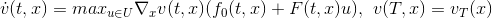

## HJB-solver 

Numerical tool to solve linear [Hamilton Jacobi Bellman Equations](https://en.wikipedia.org/wiki/Hamilton%E2%80%93Jacobi%E2%80%93Bellman_equation). I.e. an equation of the form

It is assumed that the space and the control space are one dimenional.

### The most important functions

Function  | Description
------------- | -------------
`I=reachableset(x,U,h,Psi,f0Psi,FPsi,f0,F)`  | calculates discrete reachable sets. Note that this function does not depend on `g`.
`[Xi,v]=HJB( t0,T,N,M1,M2,f0,F,g,U,Omega0)`   | Main function: Returns a Matrix of node Values and the corresponding values of v.
`v=optimization(Xi,vXi,I,i,j)` | Performs one step assuming the reachable set `I` has already been calculated.

### Arguments for the main function

Argument | Description | Example
------- | ---------- | --------
t0      | start of timehorizon  | 0
T       | end of timehorizon | 1
N       | Number of time steps | 10
M1, M2  | Number of space steps | 10
f0      | affine part of the RHS | @(t,x) x
F       | linear part of the RHS | @(t,x) sin(x)
g       | Boundary value function | @(t,x) t*exp(x)
U       | Control set | [1, 5]
Omega0  | initial set | [2, 7]
