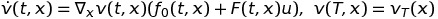

## HJB-solver

Numerical tool to solve linear [Hamilton Jacobi Bellman Equations](https://en.wikipedia.org/wiki/Hamilton%E2%80%93Jacobi%E2%80%93Bellman_equation). I.e. an equation of the form

It is assumed that the space and the control space are one dimenional.

